# Evals Information Architecture

## Goal

把 `/evals` 从“混合了 dashboard / debugger / labeling 的单页工具”重构成四个明确心智区域：

1. `Overview`
2. `Diagnosis`
3. `Trace Lab`
4. `Review Queue`

## Diagram

```mermaid
flowchart TD
    A["/evals"] --> B["Overview"]
    A --> C["Diagnosis"]
    A --> D["Trace Lab"]
    A --> E["Review Queue"]

    B --> B1["North Star Cards<br/>HVFTR / Reuse / Auto Eval Coverage / Review Coverage"]
    B --> B2["Flywheel Funnel<br/>feed -> think -> save -> reuse"]
    B --> B3["Recent Trend<br/>7d HVFTR / coverage / guardrail"]
    B --> B4["Entry Point Health<br/>feed / think / save_insight / compile / lint"]

    C --> C1["Coverage Gaps<br/>missing auto eval / missing judge / pending review"]
    C --> C2["Human Failure Hotspots<br/>failure code clusters"]
    C --> C3["Automated Failure Hotspots<br/>failed evaluator clusters"]
    C --> C4["Regression Watch<br/>current 7d vs previous 7d"]
    C --> C5["Evaluator Heatmap<br/>entry point x evaluator"]

    D --> D1["Trace Queue<br/>filter by entry point / status / review state"]
    D --> D2["Trace Overview<br/>actions: run code eval / run judge"]
    D --> D3["Trace Payload<br/>request / response / metadata"]
    D --> D4["Span Timeline<br/>span status / latency / error"]
    D --> D5["Auto Eval Results<br/>code eval + llm judge outputs"]
    D --> D6["Human Context<br/>labels + user feedback"]

    E --> E1["Queue Summary<br/>pending review / priority pending"]
    E --> E2["Review Queue<br/>default focus: unreviewed traces"]
    E --> E3["Review Composer<br/>dataset / failure code / pass-fail / notes"]
    E --> E4["Evidence Panel<br/>same trace detail as Trace Lab"]
```

## Mapping To Backend

- `Overview` 读取 `buildEvalMetrics().overview`
- `Diagnosis` 读取 `buildEvalMetrics().diagnosis`
- `Trace Lab` 读取 `/api/evals/traces`
- `Review Queue` 读取 `/api/evals/traces` + `/api/evals/labels`

## Design Rules

- `Overview` 只回答“系统现在怎么样”
- `Diagnosis` 只回答“主要问题在哪里”
- `Trace Lab` 只回答“单条 trace 为什么这样”
- `Review Queue` 只回答“下一条该审什么、怎么审”
- 默认先看趋势和热力图，再决定是否钻进 trace

## What Should Not Appear In Overview

- 大段原始 JSON
- 手工标注表单
- 单条 trace 的 span 细节
- judge 手动运行控件

## What Makes This Better

- 降低认知切换成本：先看结果，再看原因，最后才钻单条
- 让指标和操作分层：dashboard 不再和 labeling 混在一起
- 把 `compile` / `lint` 放进统一入口健康视图，而不是埋在 trace 列表里
- 用 `Regression Watch` 和 `Evaluator Heatmap` 直接暴露退化点，而不是靠人肉扫表
