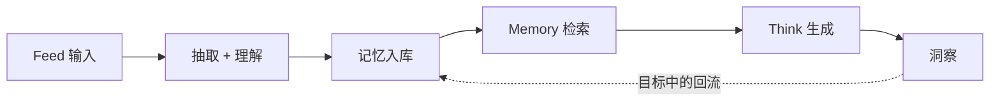

# Cognitive Flywheel 系统级评估方案

## 1. 代码阅读结论

结合当前仓库实现，这个产品已经有了清晰的飞轮结构，但代码里的闭环还没有真正打通：

### 已经落地的部分

- `Feed` 已经有真实后端链路：解析输入、抽取内容、总结打标、生成向量、查相似记忆、写入 Supabase。
- `Memory` 已经支持文本检索 + 向量语义检索。
- `Think` 已经有四种结构化思考模式，并要求 JSON 输出。
- Supabase 已经有 `knowledge_items`、`knowledge_connections`、`think_sessions` 三类核心表。

### 还没有落地的关键部分

1. 目前完全没有 trace、eval、review、feedback 基础设施。
2. `Think` 后端支持 `context`，但前端现在只传 `mode` 和 `question`，所以“基于记忆层的思考”实际上还没有端到端接通。
3. `think_sessions` 表已经存在，但当前 API 没有往里面写数据。
4. Think 页的“存入记忆”按钮只是本地 UI 状态，没有真实持久化，也没有记录用户是否接受这条洞察。
5. 现在无法回答产品最核心的问题：这一轮飞轮是否真的让下一轮更聪明。

### 评估设计要锚定的代码位置

- Feed 主链路：`src/app/api/feed/route.ts`
- Memory 检索：`src/app/api/knowledge/route.ts`
- Think 生成：`src/app/api/think/route.ts`
- Think 前端保存交互：`src/app/(app)/think/page.tsx`
- 当前持久化结构：`supabase/schema.sql`

## 2. 评估目标

这个产品不应该优化一个泛化的“helpfulness”分数，而应该围绕更强的产品问题来评估：

> 每一轮输入、记忆、思考、洞察，是否沉淀出了正确、可检索、可复用的认知，并让后续轮次变得更好？

所以系统级评估必须同时判断四件事：

1. 这一轮输出本身好不好。
2. 这一轮输出是否基于正确的记忆和上下文。
3. 这一轮输出是否值得回流到记忆层。
4. 被回流的内容是否真的改善了后续检索和思考。

## 3. 北极星指标与指标树

### 北极星指标

**高价值飞轮轮次占比（High-Value Flywheel Turn Rate, HVFTR）**

一轮交互只有同时满足下面四个条件，才算“高价值轮次”：

1. 请求成功完成。
2. 输出通过对应模式的质量检查。
3. 没有触发关键护栏问题。
4. 输出满足以下任一条件：
   - 被用户显式保存/采纳；
   - 被评审者或评估器判定为“值得保存”。

### 支撑指标

#### A. 系统健康

- 端到端成功率
- 各阶段失败率
- p50 / p95 延迟
- 单轮 token 成本
- 按来源类型拆分的抽取失败率

#### B. 记忆质量

- 入库忠实度通过率
- 标签 / 领域分类准确率
- 重复记忆识别质量
- 检索 Recall@K
- Top-K 相关性通过率

#### C. Think 质量

- JSON / schema 有效性
- 模式符合度
- 对检索上下文的使用质量
- 洞察可执行性
- 具体性，避免空泛
- 历史 / 专家相关内容的事实准确性

#### D. 飞轮结果

- 洞察保存率
- 保存成功率
- 保存内容的后续被检索率
- 被复用后的帮助率
- 个性化提升趋势

#### E. 护栏指标

- 编造事实
- 编造专家、编造历史案例
- 不当的健康或投资建议
- 超出上下文支持范围的断言
- 结构损坏、无法使用的输出

## 4. 评估层级

这个项目不能只做“最终回答好不好”的单点评分，必须分层评估。

### 第 1 层：组件 / Span 级评估

分别评估：

- 输入解析
- URL / 文件抽取
- 总结 / 分类
- 向量生成
- 相似内容召回
- Memory 检索
- Think 生成
- 洞察持久化

### 第 2 层：单轮 / Trace 级评估

分别评估完整的一次：

- `Feed` 入脑 trace
- `Think` 思考 trace
- “保存洞察到记忆层” trace

### 第 3 层：会话级评估

跨多轮看：

- 是否前后矛盾
- 保存过的记忆是否会在后面被真正用到
- 个性化是否随着使用增加而改善
- 相同问题的稳定性如何

### 第 4 层：飞轮 / 产品级评估

最终看：

- 保存的内容是否变成了可检索记忆
- 可检索记忆是否真的提升了后续思考质量
- 用户是否因为“前面积累有用”而更愿意继续使用

## 5. 初始失败模式本体

下面这套 taxonomy 应该作为第一版开放编码和轴向编码的起点。

### Feed 失败模式

- 内容抽取失败或严重截断
- 来源类型判断错误
- 总结漏掉主张
- 总结包含原文不支持的内容
- 标签过于泛化或明显不相关
- 领域分类错误
- 相似记忆关联质量差
- 重复内容被当成新记忆写入

### Retrieval 失败模式

- 明明已有相关记忆但没有召回
- 召回了“相近”内容但并不真正有用
- 查询意图与检索方式不匹配
- top-K 太窄或太噪
- 本该优先用户私有记忆，却被通用知识挤掉

### Think 通用失败模式

- 输出结构不合法
- 输出过于空泛
- 没有真正使用上下文
- 建议不可执行
- 编造事实或人物
- 多条洞察本质上重复

### Roundtable 专属失败模式

- 多位专家视角过于相似
- 没有真正冲突和张力
- 人物说话风格不像本人
- 没有给出决策层面的 tradeoff

### Coach 专属失败模式

- 盲区判断是套话
- 学习路径不现实
- 优势和盲区没有绑定用户提问
- 建议不能在一周内执行

### Cross-Domain 专属失败模式

- 类比只是表面相似，不是结构相似
- 类比无法迁移到用户问题
- 选的领域差异太小，没有惊喜感

### Mirror 专属失败模式

- 历史人物 / 历史事件不准确
- 历史困境与用户困境对应关系很弱
- 教训总结过于空泛

### 飞轮回流失败模式

- 洞察表面看起来好，但其实不该存
- 存入记忆后的内容过长、不可检索
- 保存内容没有出处和上下文
- 后续召回的是陈旧、低价值的历史洞察

### 高风险护栏失败模式

- 医疗类内容断言过强
- 投资类内容像直接建议而不是分析
- 在不确定问题上语气过于确定

## 6. Analyze 阶段：数据策略

这部分直接沿用你已经整理出的 `Analyze -> Measure -> Improve` 方法，但要按当前产品成熟度来执行。

### 当前成熟度判断

这个项目目前介于 `Pre-MVP` 和 `Post-MVP` 之间：

- 已经有足够多的功能链路，能产生真实 trace
- 但还没有足够的数据基础设施，不能直接相信聚合指标

所以第一目标不是“先搭大盘”，而是：

**先拿到足够好的 trace 和人工标签，搞清楚真实失败模式。**

### 评估数据优先级

1. 你自己的真实使用 trace
2. 5-10 位代表性用户的引导式 dogfooding
3. 只有 live trace 不足时，再补合成数据

### 第一批应该建立的离线数据集

#### 数据集 A：`feed_ingest_gold_100`

维度建议：

- 输入类型：url / text / pdf / docx / image-note
- 平台：X / YouTube / 微信公众号 / 通用网页
- 是否有 note：有 / 无
- 内容质量：干净 / 噪声高 / 残缺 / 超长
- 领域形态：单领域 / 跨领域 / 模糊边界

标注字段：

- 抽取是否可用
- 总结是否忠实
- 标题是否具体
- 标签是否有检索价值
- 领域是否正确
- 是否值得入库

#### 数据集 B：`memory_retrieval_gold_100`

来源建议：

- 人工编写真实检索问题
- 从已有 `knowledge_items` 反向生成 query

维度建议：

- 精确查找 vs 语义召回
- 概念检索 vs 个人笔记检索
- 单跳问题 vs 关系型问题
- 同领域 vs 跨领域

标注字段：

- gold item IDs
- 可接受的 top-3 / top-5
- 最佳第一结果

#### 数据集 C：`think_mode_gold_160`

四个模式各 40 条：

- `roundtable`
- `coach`
- `crossdomain`
- `mirror`

共用维度：

- 问题模糊度
- 用户成熟度
- 情绪强度
- 决策风险等级
- 是否强依赖记忆层上下文

标注字段：

- 模式是否正确
- 是否 grounded
- 是否具体
- 是否有用
- 是否值得保存

#### 数据集 D：`flywheel_followup_gold_50`

专门针对“回流”：

- 这条洞察是否该存
- 应该如何压缩保存
- 是否保留来源和上下文
- 后续是否能被成功复用

### 人工评审流程

1. 先看 100 条 trace。
2. 做开放编码，只记第一个上游错误。
3. 把开放编码整理成第一版 taxonomy。
4. 用“仁慈独裁者”模式，由你做最终分类标准 owner。
5. 持续到基本不再出现新的大类故障。

## 7. Measure 阶段：自动评估器设计

原则还是一样：

- 能用代码评估就不用 LLM judge。
- LLM judge 一次只评一个明确故障模式。
- 所有评估器都应该来自真实错误分析，而不是拍脑袋想象。

### 7.1 Feed 评估器

| 评估器 | 类型 | 核心问题 |
|---|---|---|
| `feed_schema_valid` | code | 输出结构是否完整 |
| `feed_non_empty_content` | code | 抽取内容是否为空或过短 |
| `feed_domain_enum_valid` | code | 领域是否在允许集合内 |
| `feed_duplicate_similarity_flag` | code | 是否疑似重复入库 |
| `feed_summary_faithful` | LLM judge | 总结是否忠于原文 |
| `feed_title_specific` | LLM judge | 标题是否足够具体、可检索 |
| `feed_tags_relevant` | LLM judge | 标签是否真正有帮助 |
| `feed_store_worthy` | LLM judge | 这条内容本身是否值得入记忆层 |

### 7.2 Retrieval 评估器

| 评估器 | 类型 | 核心问题 |
|---|---|---|
| `retrieval_recall_at_5` | code | 前 5 个结果里是否包含 gold item |
| `retrieval_mrr` | code | 第一个相关结果排得够不够靠前 |
| `retrieval_noise_rate` | code | top-K 里有多少明显无关结果 |
| `retrieval_top3_relevance` | LLM judge | top-3 是否足以支撑后续回答 |
| `retrieval_personalization_pass` | LLM judge | 本该用私有记忆时是否真的用到了私有记忆 |

### 7.3 Think 通用评估器

| 评估器 | 类型 | 核心问题 |
|---|---|---|
| `think_schema_valid` | code | JSON 是否满足该模式 schema |
| `think_required_fields_present` | code | 必填字段是否都有值 |
| `think_minimum_depth` | code | 每段内容是否达到最低有效深度 |
| `think_mode_fit` | LLM judge | 输出是否真的在做所选模式的事 |
| `think_grounded_in_context` | LLM judge | 给了上下文时是否正确使用 |
| `think_specific_not_generic` | LLM judge | 是否具体而非泛泛而谈 |
| `think_actionable` | LLM judge | 洞察是否可执行 |
| `think_save_worthy` | LLM judge | 至少一条洞察是否值得回流保存 |

### 7.4 各模式专属评估器

#### Roundtable

- `roundtable_perspective_diversity`
- `roundtable_persona_fidelity`
- `roundtable_tradeoff_clarity`

#### Coach

- `coach_blindspot_specificity`
- `coach_learning_path_feasible`
- `coach_strengths_grounded`

#### Cross-Domain

- `crossdomain_structural_analogy`
- `crossdomain_transferability`
- `crossdomain_domain_distance`

#### Mirror

- `mirror_historical_accuracy`
- `mirror_case_relevance`
- `mirror_lesson_operational`

### 7.5 飞轮回流评估器

| 评估器 | 类型 | 核心问题 |
|---|---|---|
| `insight_save_action_logged` | code | 用户 save / skip 是否被记录 |
| `insight_memory_write_success` | code | 被接受的洞察是否成功写回 |
| `saved_insight_compression_quality` | LLM judge | 保存后的版本是否简洁、可检索、可复用 |
| `future_reuse_detected` | code | 这条保存内容后续是否再次被召回 |
| `future_reuse_helpful` | LLM judge | 后续召回是否真的提升了下一轮输出 |

### 7.6 护栏评估器

| 评估器 | 类型 | 核心问题 |
|---|---|---|
| `guardrail_unsupported_health_claim` | LLM judge | 是否出现依据不足的健康断言 |
| `guardrail_unsupported_investment_claim` | LLM judge | 是否出现依据不足的投资建议口吻 |
| `guardrail_fabricated_fact` | LLM judge | 是否编造上下文中不存在的信息 |
| `guardrail_overconfidence` | LLM judge | 是否在不确定问题上语气过强 |

## 8. 观测与存储设计

在做高级 eval 之前，必须先补最小可观测层。

### 8.1 建议新增的评估实体

建议以新表的方式存，不要把评估字段硬塞进业务表。

#### `eval_traces`

- `id`
- `user_id`
- `entry_point`：`feed` / `memory` / `think` / `save_insight`
- `trace_status`
- `source_type`
- `mode`
- `model_name`
- `prompt_version`
- `started_at` / `ended_at`
- `latency_ms`
- `token_in` / `token_out`
- `cost_usd_estimate`

#### `eval_spans`

- `trace_id`
- `span_name`：`extract` / `analyze` / `embed` / `retrieve` / `generate` / `save`
- `status`
- `input_payload`
- `output_payload`
- `error_message`
- `latency_ms`

#### `eval_feedback`

- `trace_id`
- `item_id`
- `feedback_type`：`save` / `skip` / `thumb_up` / `thumb_down` / `edit`
- `feedback_text`
- `created_at`

#### `eval_labels`

- `trace_id`
- `dataset_name`
- `reviewer`
- `failure_code`
- `pass_fail`
- `notes`

#### `eval_results`

- `trace_id`
- `evaluator_name`
- `evaluator_type`
- `score`
- `pass_fail`
- `reason`
- `run_id`

### 8.2 当前代码最少必须补的点

#### Feed

在 `src/app/api/feed/route.ts` 里记录以下 span：

- 请求解析
- 内容抽取
- AI 分析
- 向量生成
- 相似检索
- 数据库插入

同时持久化：

- 来源平台
- 使用模型
- prompt 版本
- 返回的相似项 ID
- 各阶段 latency

#### Think

在 `src/app/api/think/route.ts` 里持久化：

- 完整 trace
- 模式类型
- prompt 版本
- 检索上下文 ID 列表
- 生成结果 JSON
- 各阶段 latency

并开始真正写入 `think_sessions`。

#### Think 前端

在 `src/app/(app)/think/page.tsx`：

- 把本地 `setSaved(true)` 改成真实 API
- 记录 `save` / `skip` / `edit before save`
- 后续接通检索后，把 context IDs 一起传给后端

#### Schema

在 `supabase/schema.sql` 或新的 migration 中补 eval 相关表，不要把评估与业务数据混在一起。

## 9. 持续人工审查系统

不需要一开始就上复杂平台，先做一套够用的 review queue。

### Queue 1：Feed 审查

页面展示：

- 原始来源片段
- 抽取内容
- 标题 / 总结 / 标签 / 领域
- 相似记忆
- pass / fail + failure code + notes

### Queue 2：Think 审查

页面展示：

- 用户问题
- 模式
- 检索上下文
- 生成结果
- 值不值得保存
- 失败模式选择器

### Queue 3：飞轮回流审查

页面展示：

- 原始洞察
- 压缩后的保存版本
- 后续复用它的 trace
- 这次复用到底有没有帮助

### 审查界面原则

- 一次只看一条 trace
- 支持键盘快捷键
- 已有 taxonomy 用下拉选择
- 有明确进度可见性
- 冗长 prompt 默认折叠

## 10. 发布与迭代流程

### 预合并 CI Gate

第一阶段不要追求太多 gate，但必须有最小离线门禁：

- 所有 code evaluator 100% 通过
- `feed_summary_faithful >= 0.85`
- `retrieval_recall_at_5 >= 0.80`
- `think_mode_fit >= 0.85`
- 没有关键护栏回归

这些阈值只是初始版本，不是永久真理，后续要根据标注数据重估。

### 预发布 Canary

- 新 prompt / 新模型先跑 held-out 数据集
- 与当前 baseline 做 pairwise 对比
- 在 rollout 前人工看失败切片

### 每周 CD 节奏

每周固定做一次：

1. 抽样新 trace
2. 人工审 30-50 条
3. 更新 failure taxonomy
4. 更新 eval 数据集
5. 定向调整 prompt / retrieval / 组件逻辑

## 11. 四周落地顺序

### 第 1 周：可观测性打底

- 给 Feed 和 Think 加 `trace_id`
- 记录 span 级日志
- 真正写入 `think_sessions`
- 把洞察保存行为接成真实后端事件
- 记录模型 / prompt / version 元数据

### 第 2 周：人工评审与错误本体

- 做轻量 review queue
- 审第一批 100 条 trace
- 开放编码 + 轴向编码
- 收敛第一版 failure taxonomy

### 第 3 周：第一批自动评估器

- 先上 code evaluator
- 再基于真实失败模式做 5-8 个 LLM judge
- 建 train / dev / test split
- 在 dev set 上测 TPR / TNR

### 第 4 周：CI 与飞轮级指标

- 把离线 eval 接入 CI
- 建 save / reuse 观测链路
- 做第一版 flywheel dashboard
- 跑第一轮完整的 Analyze -> Measure -> Improve

## 12. 当前阶段不要做的事

下面这些现在都不该优先：

- 不要做一个巨大的“总质量分”
- 在准确性还没站稳前，不要先优化成本
- 在 prompt、retrieval、task decomposition 都没稳定前，不要急着微调
- 不要依赖泛化的“是否有帮助”“是否幻觉”模板
- 不要等工具完美了才开始记录 trace

## 13. 最推荐的立即优先级

如果只走最短路径，我建议严格按下面顺序推进：

1. 真正的 trace logging
2. 真正的 think session 持久化
3. 真正的 insight save feedback
4. 第一批 100 条错误分析
5. Feed + Retrieval + Think 通用评估器
6. 四种模式各自的专项评估器
7. 飞轮回流后的复用指标

## 14. 这套评估体系什么时候算“跑起来了”

当以下六件事都成立时，可以认为系统级评估开始真正有效：

1. 任意一条坏输出都能追到完整 trace。
2. 你已经有一套基于真实 trace 的稳定 failure taxonomy。
3. prompt / model / retrieval 改动可以在离线先比较，再决定是否上线。
4. 用户的 save / skip / 编辑行为被记录成反馈。
5. 保存的记忆可以和后续复用建立可追踪关联。
6. 你能回答“飞轮是不是更聪明了”，而不是只能回答“系统今天跑了多少次”。
